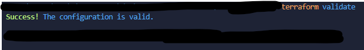
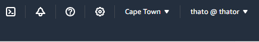

# AWS VPC with Terraform


This project utilizes Infrastructure as Code (IaC) to manage a Virtual Private Cloud (VPC) on AWS. The demonstration showcases the provisioning of secure network infrastructure on AWS using Terraform configurations.

🔧**Terraform** is an open-source infrastructure as code (IaC) tool created by Hashicorp. It allows you to define and provision infrastructure resources such as virtual machines, networks, etc.

☁️**Virtual Private Cloud (VPC)** is a virtual network environment within a cloud provider's infrastructure that you can configure according to your specific requirements. It allows you to provision a logically isolated section of the cloud where you can launch resources such as virtual machines, containers, databases, and more

## Prerequisites

 * Active [AWS Account](https://aws.amazon.com/)
 * [AWS CLI](https://docs.aws.amazon.com/cli/latest/userguide/getting-started-install.html) setup
 * [Terraform installed](https://developer.hashicorp.com/terraform/tutorials/aws-get-started/install-cli) locally

## Defining Variables

Terraform variables are used to parameterize your configuration, allowing you to reuse the same configuration with different values. We simply use variables for the reusability and flexibility they provide for future changes to our configuration code. 

Create an empty directory and create a new file named variables.tf. For this part of the article we will be working on the variables file and start writing our configuration code as follows:

```json
variable "profile" {
  description = "AWS profile name to use for authentication"
  default     = "default"
}

variable "region" {
  description = "AWS region where resources will be created"
  default     = "af-south-1"
}

variable "vpc_cidr_block" {
  description = "CIDR block for the VPC"
  default     = "10.0.0.0/16"
}

variable "public_subnet_cidr_block" {
  description = "CIDR block for the public subnet"
  default     = "10.0.1.0/24"
}

variable "private_subnet_cidr_block" {
  description = "CIDR block for the private subnet"
  default     = "10.0.2.0/23"
}

variable "http_ingress_cidr_block" {
  description = "CIDR block for allowing HTTP ingress traffic"
  default     = "0.0.0.0/0"
}

variable "http_ingress_port" {
  description = "Port for allowing HTTP ingress traffic"
  default     = 80
}
```

In the above code, we defined seven variables and their respective descriptions. Note the CIDR block (IP address range) in the private subnet ends with '/23' which means there are more IP addresses in this subnet compared to the public subnet ending in '/24'. 

Private subnets are often assigned larger CIDR blocks than public subnets. This is done to accommodate the potential growth and scalability of resources within the private subnet. 

## Setting up VPC

In the same directory as the variables file, create another file named main.tf. This file is where we define the main infrastructure resources and configurations for our Terraform project.

### Provider Block

```JSON
#1 Provider Block
provider "aws" {
  profile = var.profile
  region  = var.region
}
```

### Set up VPC

```JSON
#2 Set up a Private Virtual Private Network (VPC)
resource "aws_vpc" "thato_vpc" {
  cidr_block = var.vpc_cidr_block
  tags       = {
    Name = "ThatoVPC"
  }
}
```

### Create public subnet

```JSON
#3 Create a public subnet
resource "aws_subnet" "thato_public_subnet" {
  vpc_id     = aws_vpc.thato_vpc.id
  cidr_block = var.public_subnet_cidr_block
  tags       = {
    Name = "ThatoPublicSubnet"
  }
}
```

### Create private subnet

```JSON
#4 Create a private subnet
resource "aws_subnet" "thato_private_subnet" {
  vpc_id     = aws_vpc.thato_vpc.id
  cidr_block = var.private_subnet_cidr_block
  tags       = {
    Name = "ThatoPrivateSubnet"
  }
}
```

### Create Internet Gateway for public subnet

```JSON
#5 Create Internet Gateway for public subnet
resource "aws_internet_gateway" "thato_igw" {
  vpc_id = aws_vpc.thato_vpc.id
  tags   = {
    Name = "ThatoIGW"
  }
}
```

### Create a route table for public subnet

```JSON
#6 Create a route table for public subnet
resource "aws_route_table" "thato_public_rt" {
  vpc_id = aws_vpc.thato_vpc.id
  route {
    cidr_block = "0.0.0.0/0"
    gateway_id = aws_internet_gateway.thato_igw.id
  }

  tags   = {
    Name = "ThatoRouteTable"
  }
}
```

### Create route table association with the public subnet

```JSON
#7 Create route table association with public subnet
resource "aws_route_table_association" "thato_rt_association" {
  subnet_id      = aws_subnet.thato_public_subnet.id
  route_table_id = aws_route_table.thato_public_rt.id
}
```

### Create a security group for public subnet


```JSON
#8 Create Security Group for public subnet
resource "aws_security_group" "thato_public_sg" {
  vpc_id = aws_vpc.thato_vpc.id
  name   = "ThatoPublicSG"

  # Define ingress rules (incoming traffic)
  ingress {
    from_port   = var.http_ingress_port
    to_port     = var.http_ingress_port
    protocol    = "tcp"
    cidr_blocks = [var.http_ingress_cidr_block] # Allow incoming HTTP traffic from anywhere
  }

  # Define egress rules (outgoing traffic)
  egress {
    from_port   = 0
    to_port     = 0
    protocol    = "-1" # Allow all outbound traffic
    cidr_blocks = ["0.0.0.0/0"]
  }

  tags = {
    Name = "ThatoPublicSG"
  }
}
```

## Running Terraform

Spin up your terminal in the project directory and run the following commands:

terraform init

This prepares your working directory for other commands and you should see the following in your terminal:


```JSON
terraform validate
```

This checks whether the configuration is valid and if all is good you should see the following in your terminal:



```JSON
terraform plan
```

This show changes required by the current configuration and you should see the following in your terminal:


A total of seven resources have been created.

```JSON
terraform apply
```

This creates or updates infrastructure and you should see the following in your terminal:


## Verifying Created Resources in AWS Management Console

Verify that all resources have been created successfully by loggin in on your AWS management console under VPCs. Ensure that you are in the right region as per your configuration. I chose the Cape Town region for this project.



Created VPC


Created Subnets


Created Internet Gateway


Created Route Table


Created Security Group


## Cleaning Up

Let's clean up the resources we have created for this article.

```JSON
terraform destroy
```

This command will destroy all the network resources created to avoid unnecessary costs and you should see the following in your terminal:


## Conclusion:

This article showed you how to create your network infrastructure in the AWS cloud. You also learned to initiate, apply, and secure your subnets using Terraform.

## PS:

Terraform is a tool of choice for this project because it's easy to learn and using it to provision infrastructure comes close to how professionals perform their day-to-day work in the cloud. We could have easily used AWS Management Console, but it is not so effective in the long run.


